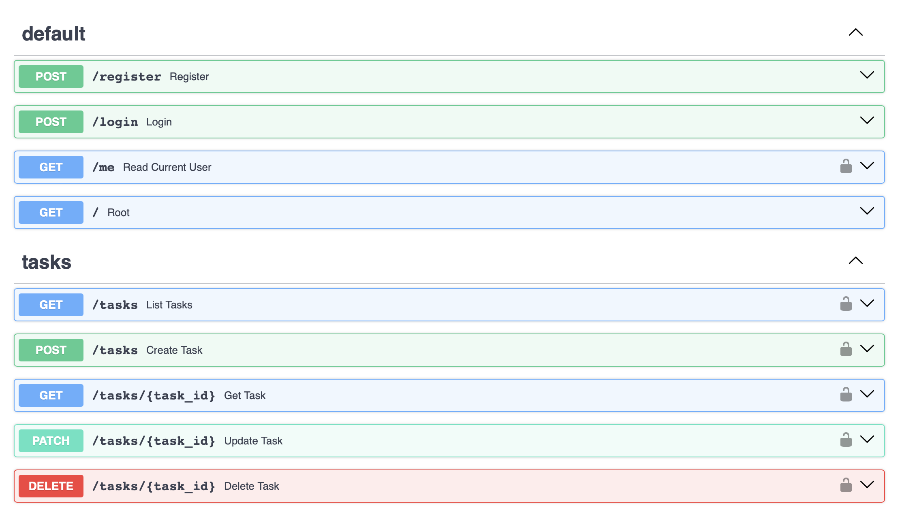
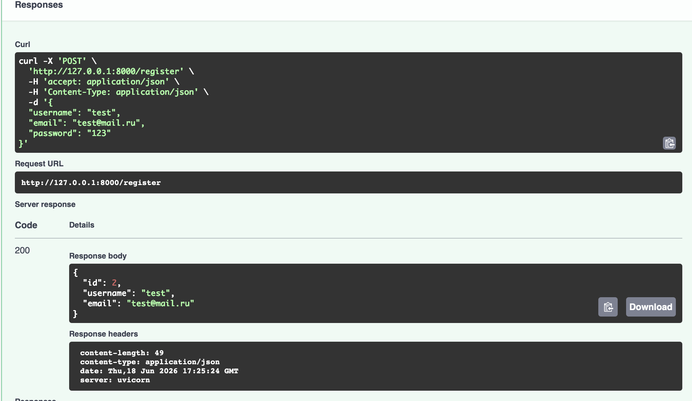
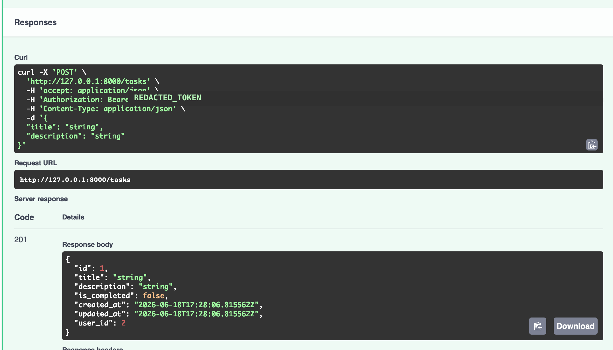

# Task Manager API

A portfolio-ready FastAPI backend for managing user accounts and personal
tasks. The project demonstrates a practical backend stack with PostgreSQL,
SQLAlchemy models, Alembic migrations, JWT authentication, Docker, automated
tests, and Ruff code quality checks.

## API Screenshots

Swagger UI overview:



Registration request example:



Authenticated task creation example:



The task example uses a redacted bearer token so the README can be shared
publicly without exposing credentials.

## Features

- User registration with unique email and username validation
- Password hashing with Argon2 through `pwdlib`
- Login endpoint that returns a JWT access token
- Authenticated current-user endpoint
- Authenticated task CRUD endpoints
- User-owned task access so users can only manage their own tasks
- Environment-based configuration with `.env`
- PostgreSQL database integration with SQLAlchemy
- Alembic database migrations
- Docker Compose setup for the API and PostgreSQL
- Pytest test suite
- Ruff linting in local development and CI

## Tech Stack

- Python
- FastAPI
- PostgreSQL
- SQLAlchemy
- Pydantic
- Alembic
- PyJWT
- pwdlib with Argon2
- Docker and Docker Compose
- Pytest
- Ruff
- GitHub Actions

## Project Structure

```text
task-manager-api/
├── app/
│   ├── api/              # FastAPI route handlers and dependencies
│   ├── core/             # Authentication, JWT, and security helpers
│   ├── database/         # SQLAlchemy engine, session, and Base setup
│   ├── models/           # SQLAlchemy database models
│   ├── schemas/          # Pydantic request and response schemas
│   └── main.py           # FastAPI application entry point
├── alembic/
│   ├── versions/         # Database migration files
│   └── env.py            # Alembic configuration
├── tests/                # Pytest test suite
├── .github/workflows/    # GitHub Actions CI workflow
├── Dockerfile            # API container image
├── docker-compose.yml    # API and PostgreSQL services
├── requirements.txt      # Runtime dependencies
├── requirements-dev.txt  # Development and test dependencies
└── pyproject.toml        # Ruff configuration
```

## Environment Variables

Create a local `.env` file from `.env.example` before running the project:

```bash
cp .env.example .env
```

Then replace the placeholder values in `.env`.

| Variable | Purpose |
| --- | --- |
| `DATABASE_URL` | Database URL used when running the API or Alembic locally. |
| `JWT_SECRET_KEY` | Secret key used to sign JWT access tokens. Use a strong random value. |
| `JWT_ALGORITHM` | JWT signing algorithm, such as `HS256`. |
| `JWT_ACCESS_TOKEN_EXPIRE_MINUTES` | Access token lifetime in minutes. |
| `POSTGRES_USER` | PostgreSQL username used by Docker Compose. |
| `POSTGRES_PASSWORD` | PostgreSQL password used by Docker Compose. |
| `POSTGRES_DB` | PostgreSQL database name used by Docker Compose. |
| `APP_PORT` | Host port exposed by Docker Compose. |

Generate a strong random secret without storing it in source code:

```bash
python -c "import secrets; print(secrets.token_hex(32))"
```

Do not commit the real `.env` file or any real secrets.

## Docker Setup

Docker Compose starts both the FastAPI application and PostgreSQL.
PostgreSQL data is stored in the `postgres_data` Docker volume.

1. Create `.env` from `.env.example`.
2. Replace `POSTGRES_PASSWORD` and `JWT_SECRET_KEY` with secure values.
3. Start the stack:

```bash
docker compose up --build
```

The API will be available at:

```text
http://127.0.0.1:8000
```

Swagger UI will be available at:

```text
http://127.0.0.1:8000/docs
```

The application container waits for PostgreSQL to become healthy, runs
`alembic upgrade head`, and then starts Uvicorn.

Useful Docker commands:

```bash
docker compose down
docker compose down --volumes
```

Use `docker compose down --volumes` only when you want to delete the local
Docker database volume.

## Local Development Setup

These commands assume Python is already installed.

Create and activate a virtual environment:

```bash
python -m venv .venv
source .venv/bin/activate
```

On Windows PowerShell, activate it with:

```powershell
.\.venv\Scripts\Activate.ps1
```

Install runtime dependencies:

```bash
python -m pip install -r requirements.txt
```

Install development and test dependencies:

```bash
python -m pip install -r requirements-dev.txt
```

Start the API locally:

```bash
python -m uvicorn app.main:app --reload
```

The local API runs at `http://127.0.0.1:8000`.

## Database Migrations

Alembic uses the same `DATABASE_URL` environment variable as the application.
Make sure `.env` exists and points to the database you want to migrate.

Apply all migrations:

```bash
alembic upgrade head
```

Create a new migration after changing SQLAlchemy models:

```bash
alembic revision --autogenerate -m "describe the change"
```

Review every generated migration before applying it:

```bash
alembic upgrade head
```

Check migration status and history:

```bash
alembic current
alembic history
```

If an existing local database already has matching `users` and `tasks`
tables, record the current migration without recreating tables:

```bash
alembic stamp head
```

Use `stamp` only for an existing database schema that already matches the
migration.

## Tests

Run the test suite:

```bash
python -m pytest
```

The tests cover registration, login, JWT handling, current-user logic,
password verification, and task ownership behavior.

## Linting

Run Ruff locally:

```bash
python -m ruff check .
```

Ruff is configured in `pyproject.toml` to check `app`, `tests`, and `alembic`.

## API Endpoints

| Method | Endpoint | Authentication | Description |
| --- | --- | --- | --- |
| `GET` | `/` | No | Health-style root endpoint with a project message. |
| `POST` | `/register` | No | Create a new user account. |
| `POST` | `/login` | No | Authenticate a user and return a JWT access token. |
| `GET` | `/me` | Bearer token | Return the currently authenticated user. |
| `POST` | `/tasks` | Bearer token | Create a task for the current user. |
| `GET` | `/tasks` | Bearer token | List current-user tasks with optional `limit`, `offset`, `is_completed`, `sort_by`, and `sort_order` query parameters. |
| `GET` | `/tasks/{task_id}` | Bearer token | Get one task owned by the current user. |
| `PATCH` | `/tasks/{task_id}` | Bearer token | Update one task owned by the current user. |
| `DELETE` | `/tasks/{task_id}` | Bearer token | Delete one task owned by the current user. |

Interactive API documentation is available in Swagger UI at `/docs` when the
application is running.

## Continuous Integration

GitHub Actions runs on every push and pull request.

The CI workflow:

1. Checks out the repository.
2. Sets up Python.
3. Installs `requirements-dev.txt`.
4. Runs Ruff:

```bash
python -m ruff check .
```

5. Runs tests:

```bash
python -m pytest
```

CI uses environment variables with safe test-only values. Real secrets should
only live in local `.env` files or protected deployment configuration.
